# Микроконтроллеры stm32f4

Я использую два микроконтроллера stm32f407vg и stm32f411ve.

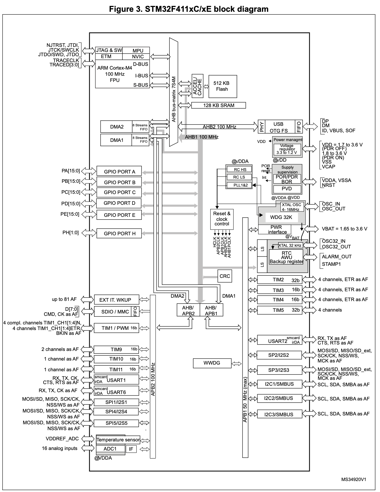

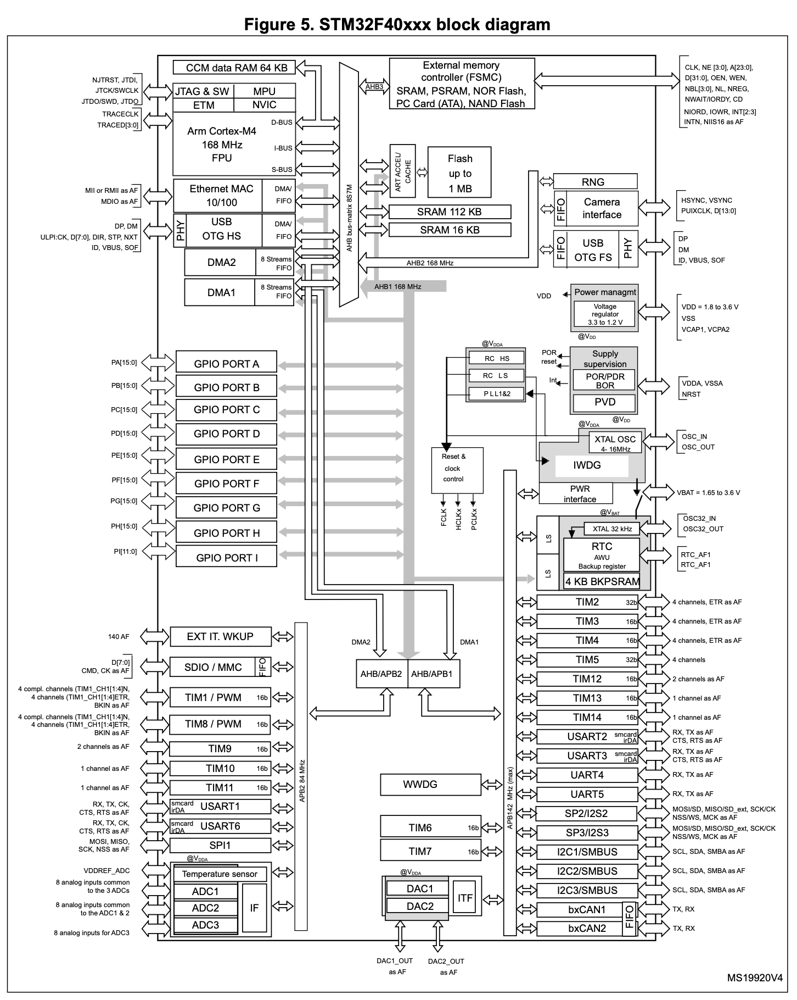


# Общие моменты

## GPIO

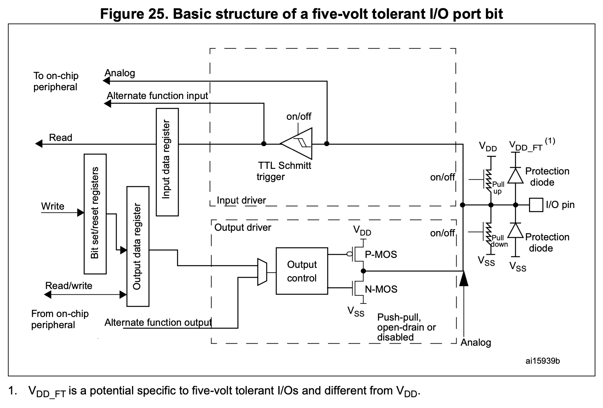


```C
// 1. Включение тактирования
RCC->AHB1ENR |= RCC_AHB1ENR_GPIOxEN;

// 2. Настроить перефирию
// Вывод
GPIOx->MODER |= (0x1 << (2 * 'pin'));  //GPIO_MODER_MODERx_0;
GPIOx->ODR |= (0x1 << 'pin');  //GPIO_ODR_ODx;  // записать 1
GPIOx->ODR &= ~GPIO_ODR_ODx;                    // записать 0
// Ввод
GPIOx->IDR |= (0x1 << 'pin');  //GPIO_IDR_IDx;
T temp = (((GPIOx->IDR) >> 'pin') & 0x00000001);  // считать значение
```

## EXTI

Внешние прерывания. Прежде всего необходимо разобраться с тем, что такое прерывания.  
В МК Cortex-M есть два понятия, которые часто путают *Interrupt* и *Event*.  
*Event* — это событие (аппаратное или программное), на которое могут реагировать ядро или периферийные блоки. Одним из вариантов реакции может быть — прерывание.  
*Interrupt* — это прерывание работы программы и переход управления в специализированный участок обработчик прерывания. 
  
Взаимосвязь между *Event* и *Interrupt* заключается в следующем:  
*Каждый Interrupt вызывается Event, но не каждый Event вызывает Interrupt.*   
Помимо прерываний, события могут активировать и другие возможности МК.

```C
//// Настройка порта прерывания
// 1. Включение тактрования
RCC->AHB1ENR |= RCC_AHB1ENR_GPIOxEN;
// 2. Настройка на чтение
GPIOx->MODER &= ~(0x03 << (2 * PIN));
// 3. Настраиваем работу на понижение или повышение ввода(в примере понижение)
GPIOx->PUPDR |= (0x1 << (2 * PIN + 1));

//// Настраиваем прерывание
// 1. Снимите маску с прерывания
EXTI->IMR |= (1 << PIN);
// 2. Установите, будет ли опускающаяся кромка или поднимающаяся кромка(опускающаяся)
EXTI->FTSR |= (1 << PIN);
// 3. Разрешение прерывания
EXTI->PR |= (1 << PIN);

//// SYSCFG
// 1. Включаем тактирование SYSC
RCC->APB2ENR |= RCC_APB2ENR_SYSCFGEN;
// 2. Настраиваем Регистр конфигурации внешнего прерывания SYSCFG пина
SYSCFG->EXTICR[y] &= ~(0xF << PIN);
// (12.06.23) - эти точки детально смотреть в документации

//// Включаем прерывания
NVIC_EnableIRQ('EXTI1_IRQn');
```

Прерывания делятся на группы:
* Пины: *0*         NVIC: **EXTI0_IRQn**
* Пины: *1*         NVIC: **EXTI1_IRQn**
* Пины: *2*        NVIC: **EXTI2_IRQn**
* Пины: *3*        NVIC: **EXTI3_IRQn**
* Пины: *4*        NVIC: **EXTI4_IRQn**
* Пины: *5-9*    NVIC: **EXTI9_5_IRQn**
* Пины: *10-15* NVIC: **EXTI15_10_IRQn**
На stm32f411ve нету всех эти прерываний.
Структура прерывания:
```C
void EXTI'1'_IRQHandler(void){
	if((EXTI->PR & EXTI_PR_PRx) != 0x00){
		// DO SOMTHING...
		EXTI->PR |= EXTI_PR_PRx;
	}
}
```

**Источники:**
* [нормальный чувак](https://github.com/sss22213/stm32f4_exti0_experience/blob/master/blink.c)

## TIM

Таймер в микроконтроллере это счетчик, который как только досчитывает до заданного временного значения генерирует прерывание. Счетчик находится отдельно от ядра и не использует его ресурсы, в отличии от прерывания. 

**Формула из лекций Денис Алексеевича:**
$$ t = (\text{ARR} \cdot \text{PSC})\frac{1}{F_{sys}} $$
Где *F_sys*  период микроконтроллера. в результате:

$$t \text{ }[\text{секунд}] = (\text{ARR} \cdot \text{PSC})\frac{10^{-7}}{8}$$

Частота тактов TIMx зависит от частоты шины APB. [Источник](http://microsin.net/programming/arm/an4776-general-purpose-timer-cookbook.html)

### TIM6 и TIM7

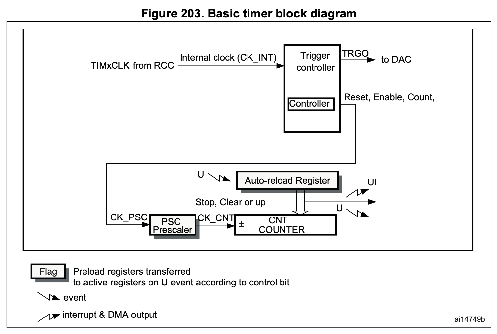
Это считается самым простым таймером, он есть в stm32f407vg, но почему-то его нет в stm32f411ve.

Инициализация:
```C
// 1. Включаем тактирование
RCC->APB1ENR |= RCC_APB1ENR_TIM6EN;
// 2. Настраиваем время по формуле
TIM6->ARR = 4000;
TIM6->PSC = 500;
```
$$ t = (\text{ARR} \cdot \text{PSC})\frac{1}{F_{sys}} $$

```C
// 3. Включение прерываний
TIM6->DIER |= TIM_DIER_UIE;           //Разрешения прерывание от таймера
NVIC_EnableIRQ(TIM6_DAC_IRQn);        //Разрешение TIM6_DAC_IRQn прерывания
NVIC_SetPriority(TIM6_DAC_IRQn, 2);
// 4. Включение таймера
TIM6->CR1 |= TIM_CR1_CEN;
```

По аналогии инициализация работает и для *TIM7* меняем *TIM6* на *TIM7*, для другого таймера.

Прерывания:
```C
void TIM6_DAC_IRQHandler(void) {
	TIM6->SR &= ~TIM_SR_UIF;  //Сбрасываем флаг прерывания
	// TIM6->CR1 &= ~TIM_CR1_CEN;  // Соответсвенно в прирывании можно так же \
								   // отключить таймер
	// Наш код что то делает.
	// Тут не должно быть много кода, действий и т д
    // ...
}
```

**Источники:**
* Лекции
* [Статья 1](https://cxem.net/mc/mc250.php)

### TIM2 to TIM5

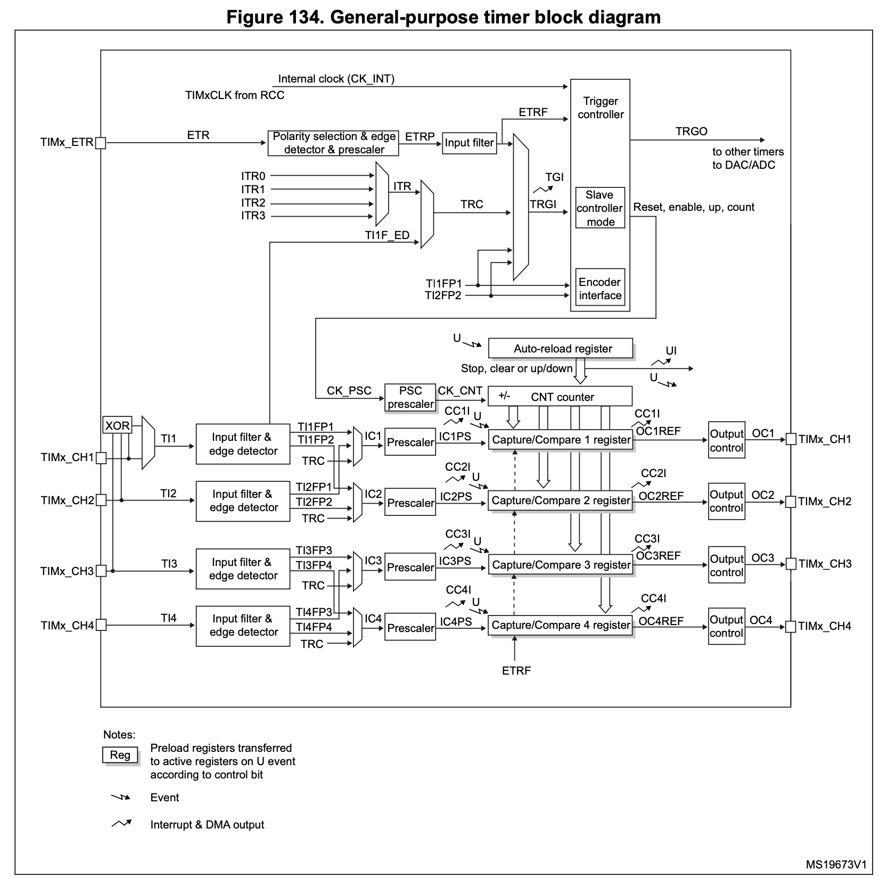
Инициализируются точно так же, есть тонкости работы **(31.05.23 - с ними не сталкивался)**

### TIM1 and TIM8

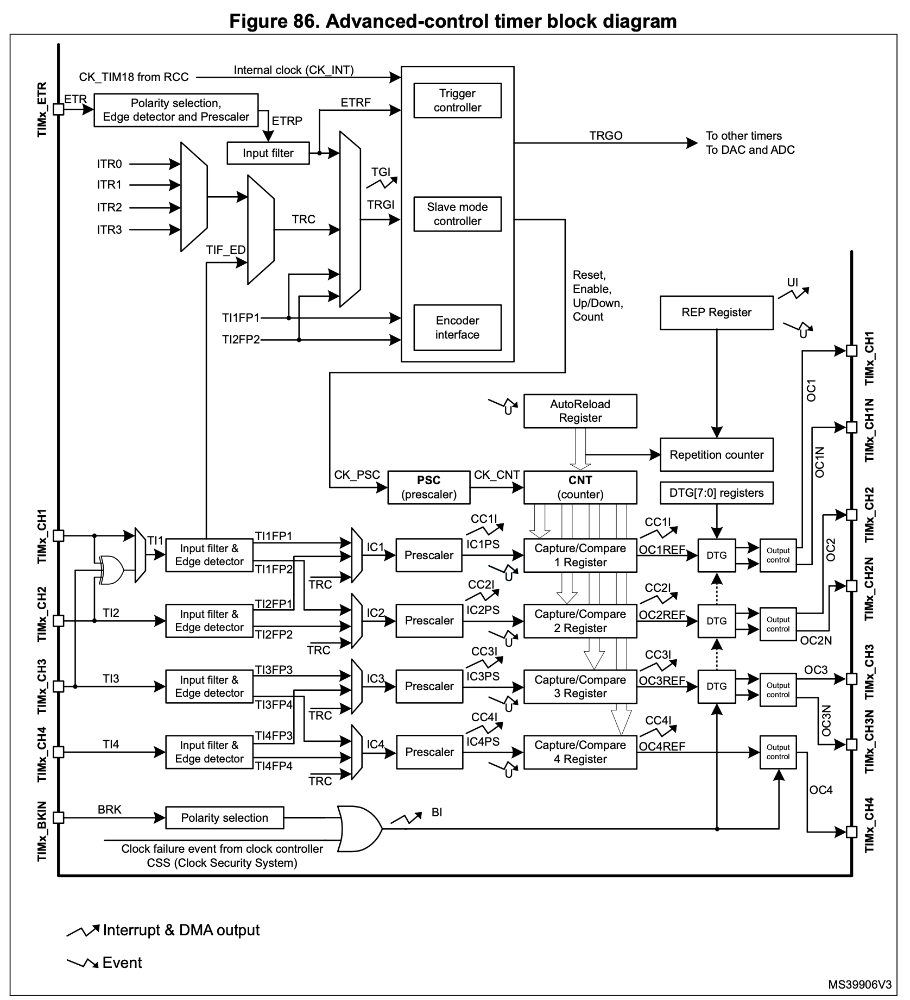

**(01.06.23)** Детально не разбирал, но думаю логика такая же как +- с остальными, просто добавляются новые функции.

### TIM9 to TIM14

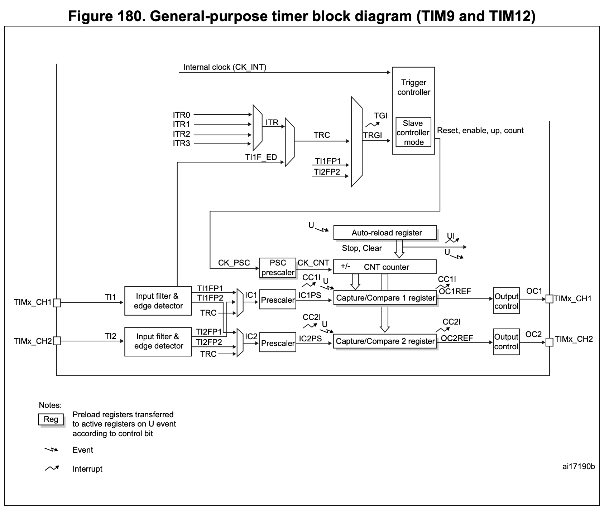


### ШИМ

**Широтно-импульсная модуляция** (ШИМ, pulse-width modulation (PWM)) — процесс управления мощностью методом пульсирующего включения и выключения потребителя энергии.
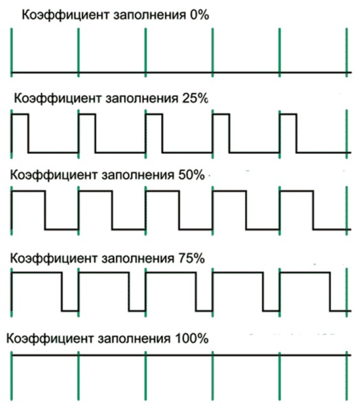

Сигнал ШИМ характеризуется скважностью **S** или её обратно величиной - коэффициент заполнения **D**. 
$$S = \frac{T}{\tau} = \frac{1}{D}$$
Будет полезно вспомнить формулу для периода таймера:
$$ t = (\text{ARR} \cdot \text{PSC})\frac{1}{F_{sys}} $$
Пример плавного повышения яркости светодиода:
```C
#define PIN 12  // Номер пина
#define S 1     // длительности импульса в циклах, по умолчанию

/*  Прерывание надо для плавного увеличения ШИМ, но в целом можно и без него,
 *  а рализовать отдельными функциями. В данном случае, светодиод не будет мигать,
 *  а будет плавно загоратся.
 * */
void TIM4_IRQHandler(void) {
    // 0. Снимаем маркер прервыания
	TIM4->SR &= ~TIM_SR_UIF;
	
    // 1. Выключаем таймер для его редактирования
	TIM4->CR1 &= ~TIM_CR1_CEN;
	
    // 2. Увеличиваем длительность импульса
    if (TIM4->CCR1 != 200)
        TIM4->CCR1 += 1;
    else
        TIM4->CCR1 = S;
        
    // 3. Запускаем таймер
    TIM4->CR1 |= TIM_CR1_CEN;
}

int main(void) {
    //// Настраиваем порт светодиода
    RCC->AHB1ENR |= RCC_AHB1ENR_GPIODEN;
    
    // 0. ШИМ назначается на альтернативную функцию
    GPIOD->MODER |= (0x2 << (2 * PIN));
    GPIOD->AFR[1] |= (0x2 << 16); 
    
    //// Настравиваем ШИМ на таймере
    // 0. включаем тактирование нужного таймера
    RCC->APB1ENR |= RCC_APB1ENR_TIM4EN;

    // 1. Настраиваем период срабатывания таймера
    TIM4->PSC = 3000;
    TIM4->ARR = 100;
    
    ////  Настраиваем "захват/сравнение
    // 2. Тут включается PWM1, строка OC1M"
    TIM4->CCMR1 |= 0x60;
    
    // 3. Установка длительности импульса в циклах
    TIM4->CCR1 = S;
    
    // 4. Включение CC1
    TIM4->CCER |= 0x1;
    
    // *. Включаем прерывание
    TIM4->DIER |= TIM_DIER_UIE;    
    NVIC_EnableIRQ(TIM4_IRQn);
    NVIC_SetPriority(TIM4_IRQn, 2);
    
    // 5. Запускаем таймер
    TIM4->CR1 |= TIM_CR1_CEN;
    
    while(1);
}
```

**Источники:**
* [Формула скважности](https://yarllo.ru/wp-content/uploads/3/a/e/3ae4a94bc1267fe8774fdb8bfcbd92de.jpeg)
* [Альтернативные функции на пинах GPIO](http://microsin.net/programming/arm/stm32f407-gpio-pins-alternate-function.html)
* [Хороший человек с github](https://github.com/jrsa/stm32f4_pwm/blob/master/main.c)
* [Ещё один пример использования](https://github.com/acakbudak/stm32f4_pwm/blob/master/stm32f44re_pwm.c)
[//]: [Остановился, при поиске](https://github.com/search?q=stm32f4_PWM&type=repositories&p=6)

## flash
Flash память это внутренняя память микроконтроллера, которая сохраняет свое значение после обесточивания микроконтроллера, тем самым мы можем сохранять какие-нибудь значения.
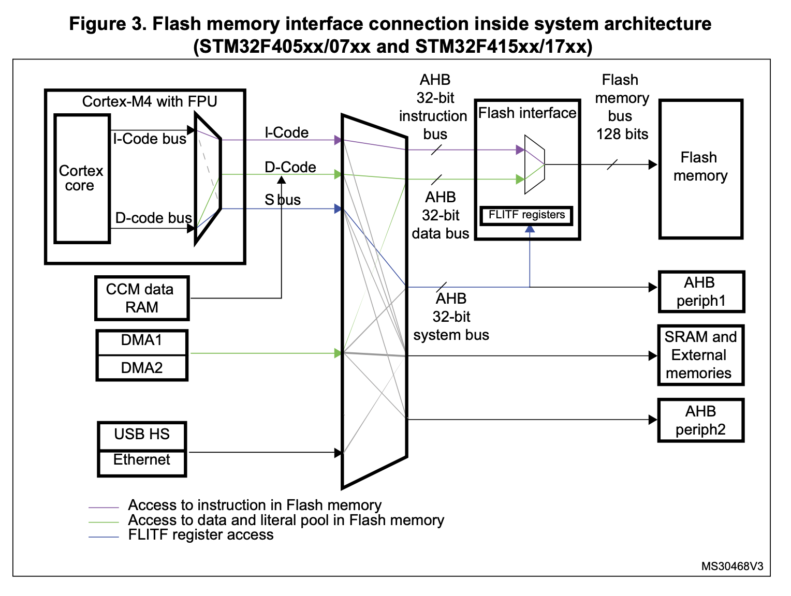
В stm32f40x и stm32f41x память разделена на 12 секторов.
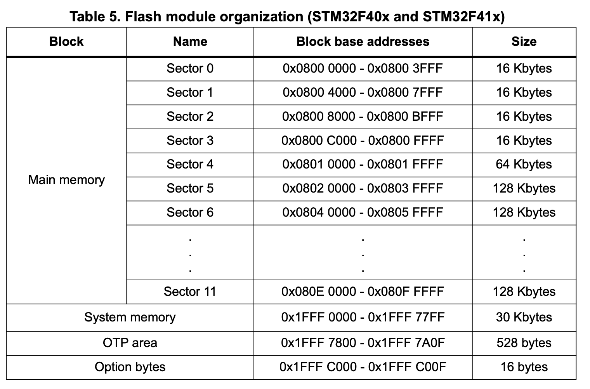
### Инициализация
Чтобы начать работу со flash ее необходимо проинициализировать. В ней используются временные задержки, таблица которых приведена ниже.
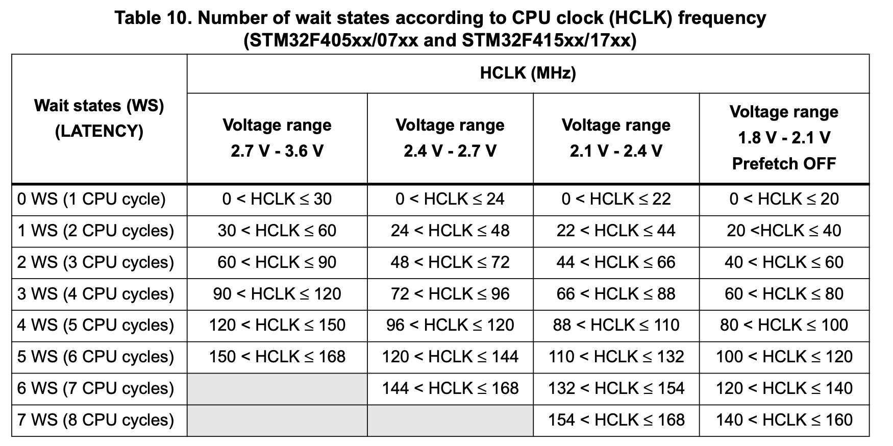
```C
void stp_flash_init() {
	//// Конфигурация FLASH
	// 1. Очистка флагов
    FLASH->ACR = 0;
	
    // 2. Установка задержки (5 секунд)
	FLASH->ACR |= FLASH_ACR_LATENCY_5WS;  // (5 <<  0);
	
    // 3. Включаем кэш команд
    FLASH->ACR |= FLASH_ACR_ICEN;  //(1 <<  9);
	
    // 4. Включаем кэш данных
    FLASH->ACR |= FLASH_ACR_DCEN;  //(1 << 10);
	
    // 5. PLL Выбран в качестве системных часов \
    // если не работает, убрать макрос.
    RCC->CFGR |= RCC_CFGR_SW_1;  //(2 <<  0);
	
    // 6. Ждем пока PLL включится
	while ((RCC->CFGR & 0x0F) != 0x0A);
}
```

### Разблокировка и блокировка доступа к памяти
Память защищена блокиратором и для того, чтобы иметь к ней доступ ее необходимо разблокировать, это возможно сделать спомощью записи двух ключей в регистр.
```C
void stp_flash_unlock() {
    //// Разблокировка памяти
    if (FLASH->CR & FLASH_CR_LOCK) {
        FLASH->KEYR = 0x45670123;
        FLASH->KEYR = 0xCDEF89AB;
    }
}
```
После работы доступ к памяти следует заблокировать.
```C
void stp_flash_lock() {
    //// Блокировка памяти
    FLASH->CR |= FLASH_CR_LOCK;
}
```
#### Уточнение
Так же после того как мы разблокировали память, стоит подождать пока она разблокируется.
```C
#define STP_FLASH_WHILE_BSY()       { while (FLASH->SR & FLASH_SR_BSY){} }
```
### Запись данных
```C
static void stp_flash_write(uint32_t address, uint8_t data) {
    //// Запись данных в одну клетку
    // 1. Разрешаем программирование
    FLASH->CR |= FLASH_CR_PG;

    // 2. Записываем в ячейку данных один байт
    *(uint8_t *)address = data;

    // 3. Ждем пока запись завершится
    STP_FLASH_WHILE_BSY();
    
    // 4. Запрещаем программирование
    FLASH->CR &= ~FLASH_CR_PG;
}

static void stp_flash_write_buffer(uint32_t address, const uint8_t * dataBuffer, uint32_t size) {
    //// Запись данных в одну ячейку
	// 1. Разблокируем память для записи данных
    stp_flash_unlock();
    
    // 2. Подождем пока произойдет разблокировка
    STP_FLASH_WHILE_BSY();

    // 3. Цикл записи
    while (size >= sizeof(uint8_t)) {
    	stp_flash_write(address, *(const uint8_t *)dataBuffer);
        address += sizeof(uint8_t);
        dataBuffer += sizeof(uint8_t);
        size -= sizeof(uint8_t);
    }

    // 4. Заблокируем память. Признак хорошего тона
    stp_flash_lock();
}

// Запись данных во flash
void stp_flash_write_8(uint32_t address, const uint8_t *dataBuffer, uint32_t size) {
	stp_flash_write_buffer(address, dataBuffer, size);
}

void stp_flash_write_16(uint32_t address, const uint16_t *dataBuffer, uint32_t size) {
    uint8_t buffer[(sizeof(uint16_t) * size)];
    memcpy(buffer, dataBuffer, (sizeof(uint16_t) * size));
    stp_flash_write_buffer(address, buffer, (sizeof(uint16_t) * size));
}

void stp_flash_write_32(uint32_t address, const uint32_t *dataBuffer, uint32_t size) {
	uint8_t buffer[(sizeof(uint32_t) * size)];
	memcpy(buffer, dataBuffer, (sizeof(uint32_t) * size));
	stp_flash_write_buffer(address, buffer, (sizeof(uint32_t) * size));
}
```

### Чтение данных
```C
// Чтение данных из flash
void stp_flash_read_8(uint32_t address, uint8_t *buffer, uint32_t size) {
    memcpy(buffer, (uint8_t*) address, size);
}

void stp_flash_read_16(uint32_t address, uint16_t *buffer, uint32_t size) {
	uint8_t char_buffer[(sizeof(uint16_t) * size)];
	memcpy(char_buffer, (uint8_t*) address, (sizeof(uint16_t) * size));
	memcpy(buffer, char_buffer, (size * sizeof(uint16_t)));
}

void stp_flash_read_32(uint32_t address, uint32_t *buffer, uint32_t size) {
	uint8_t char_buffer[(sizeof(uint32_t) * size)];
	memcpy(char_buffer, (uint8_t*) address, (sizeof(uint32_t) * size));
	memcpy(buffer, char_buffer, (size * sizeof(uint32_t)));
}
```

### Адрес памяти

```C
#define START_ADDRESS 	0x0800C000 	//	(FLASH_BASE + 48*1024)
```

### Пример использования

```C
stp_flash_init();
stp_flash_erase(3);
const uint32_t SIZE = 254;
uint32|16|8_t arr1[SIZE];
for (uint32_t i = 0; i < SIZE; ++i)
    arr1[i] = (i + 1);


stp_flash_write_32|16|8(START_ADDRESS, arr1, STP_SIZE_OF_ARRAY(arr1));
uint32|16|8_t arr2[SIZE];
stp_flash_read_32|16|8(START_ADDRESS, arr2, STP_SIZE_OF_ARRAY(arr2));
for (uint32_t i = 0; i < SIZE; i++) {
	trace_printf("error %u %u %u\n", i, *(arr2 + i), *(arr1 + i));
...
stp_flash_lock();
```

**Источники:**
* [Статья](http://microsin.net/programming/arm/stm32f4-embedded-flash-memory-interface.html)
* [Хороший человек с github](https://github.com/erenkeskin/STM32F4-Examples-with-Register/blob/master/STM32F4_FLASH_Bootloader/flash.c)
* Документация

## USART

Универсальный синхронный/асинхронный трансивер (universal synchronous asynchronous receiver transmitter, **USART**) - протокол обмена данными. Любой двунаправленный обмен USART требует как минимум двух сигнальных выводов: входные принимаемые данные (Receive Data In, RX) и выходные передаваемые данные (Transmit Data Out, TX):

**RX**: вход последовательных принимаемых данных. Используются техники передискретизации для восстановления данных, чтобы отделить полезные приходящие данные от шума.

**TX**: выход передаваемых данных. Когда передатчик запрещен, ножка выхода возвратит свою конфигурацию порта ввода/вывода (GPIO). Когда передатчик разрешен и ничего не передается, уровень выхода ножки TX находится в лог. 1. В режимах single-wire и smartcard, этот вывод I/O используется и для передачи, и для приема данных (на уровне USART данные затем принимаются на SW_RX).
[//]: 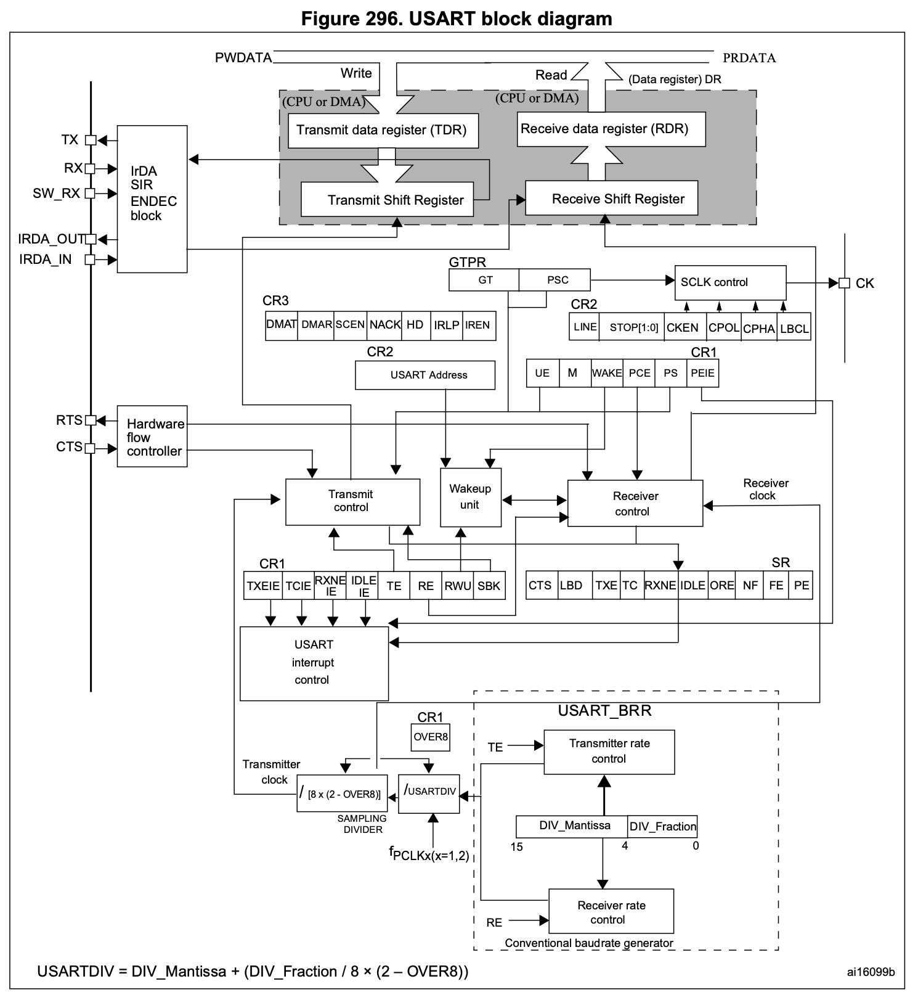

Через эти выводы последовательные данные принимаются и передаются в нормальном режиме USART как фреймы. В этом процессе используется следующее:

• Состояние ожидания линии (Idle Line) до передачи или приема.  
• Start-бит.  
• Слово данных (8 или 9 бит), самый младший бит слова (LSB) идет первым.  
• 0.5,1, 1.5, 2 Stop-стоп-бит, показывающих завершение фрейма.  
• Используется дробный генератор скорости - с 12-разрядной мантиссой и 4-битной дробной частью.  
• Регистр статуса (USART_SR).  
• Регистр данных (USART_DR).  
• Регистр генератора скорости (USART_BRR) с 12-разрядной мантиссой и 4-битной дробной частью.  
• Регистр защитного времени, Guardtime Register (USART_GTPR) в случае использования режима Smartcard.
Пример временных диаграмм:
[//]: 


**Дробный генератор скорости**. Скорость обмена (baud rate) для приемника и передатчика (обоих сигналов RX и TX) устанавливается в одинаковое значение, программируемое коэффициентами Mantissa и Fraction делителя USARTDIV.

Формула 1. скорость для стандартного USART (включая режим SPI):
$$\text{Tx/Rx baud} = \frac{f_{CK}}{8 \cdot (2 - OVER8)\cdot USARTDIV}$$
Формула 2. скорость для режимов Smartcard, LIN и IrDA:
$$\text{Tx/Rx baud} = \frac{f_{CK}}{16 \cdot USARTDIV}$$
USARTDIV это число с фиксированной запятой без знака, закодированное в регистре USART_BRR.
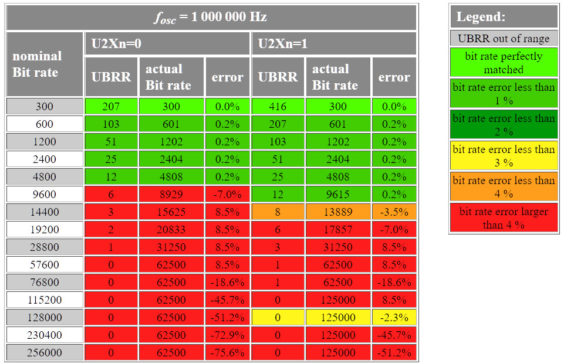

Пины на stm32f4:

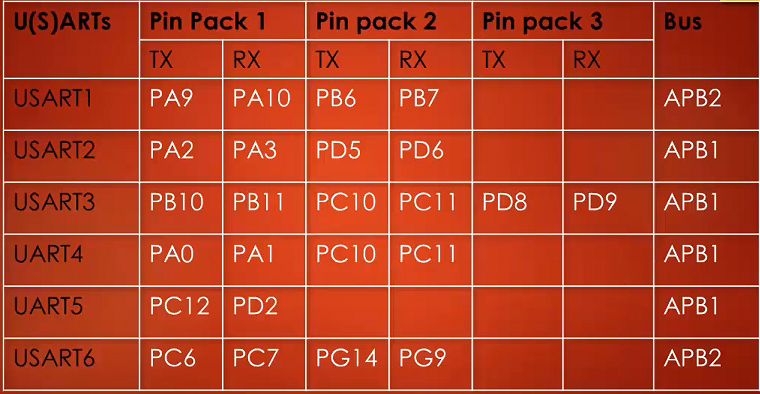

### Простая инициализация

```C
#define CPU_CLOCK SystemCoreClock
#define MY_BDR 115200

#define MYBRR (CPU_CLOCK / (16 * MY_BDR))

void GPIO_init() {
	// 1. Вкл. тактирование
	RCC->AHB1ENR |= RCC_AHB1ENR_GPIOAEN;
	// 2. назначили пины
	GPIOA->MODER |= (GPIO_MODER_MODER2_1 | GPIO_MODER_MODER3_1);
	// Альтернативные функции
	GPIOA->AFR[0] |= 0x77 << 8;
}

void USART_init() {
	// 1. Вкл тактирование
	RCC->APB1ENR |= RCC_APB1ENR_USART2EN;
	// 2. Задали частоту работы
	USART2->BRR = MYBRR;
	// 3. Настроили на чтение и запись
	USART2->CR1 |= (USART_CR1_TE | USART_CR1_RE);
	// 4. Установили STOP бит
	USART2->CR2 |= (USART_CR2_STOP_1);
	// 5. Вкл USART
	USART2->CR1 |= USART_CR1_UE;
}

/* Чтение */
uint8_t readUSART() {
	uint8_t test_usart2_sr_1 = USART2->SR;
    if ((USART2->SR & USART_SR_RXNE) == USART_SR_RXNE) {
    	return USART2->DR;
    }
    return -1;
}

/* Запись */
uint8_t writeUSART(uint8_t data) {
	uint8_t test_usart2_sr_2 = USART2->SR;
    if ((USART2->SR & USART_SR_TXE) == USART_SR_TXE) {
    	USART2->DR = data;
    	return 0;
    }
    return -1;
}

int main(void) {
	SystemCoreClockUpdate();
	GPIO_init();
	USART_init();
	uint8_t temp = 0x21;
	while(1) {
		writeUSART(temp);
		for (int i = 0; i  < 50; i++);
		uint8_t temp_read = readUSART();
		// Вывод данных
    	trace_printf("temp_read: %u\n", temp_read);
		if (temp_read != 255) {
			temp = ++temp % 254;
		}
	}
}

```

## DMA

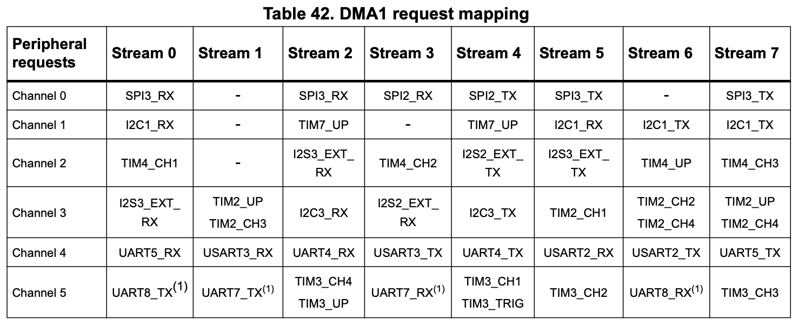

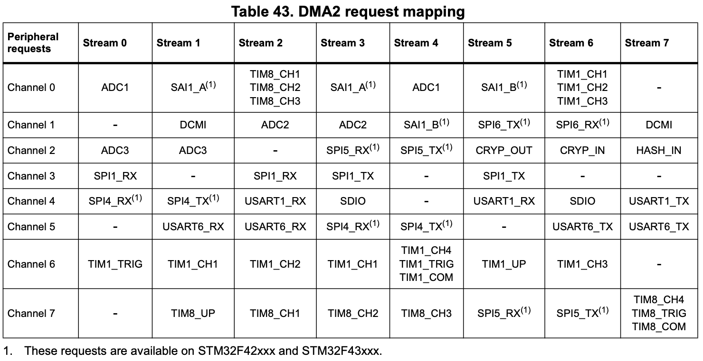


**Источники:**
* [Переведенный на русский язык Datasheat для stm32f429](https://arm-stm.blogspot.com/2016/10/stm32f-adc-with-dma-on-cmsis.html)
* [Переведенный на русский язык Datasheat для USART](http://microsin.net/programming/arm/stm32f4xx-uart-and-usart.html)

### USART + DMA


#### Полезные ссылки:
- [x] [ADC + DMA через CMSIS.](https://github.com/rmkeyser11/Engs62_Final/blob/master/DMA.c)**ШЛЯПА**
- [ ] [DMA + USART на CMSIS, но на С++](https://github.com/MCLEANS/STM32F4-USART-DMA-CONFIGURATION/blob/master/IMPLEMENTATION/src/main.cpp)
- [x] [ADC + USART + DMA, на использует атрибуты еще какие то](https://github.com/mattmcf/ARM-microprocessor-WiFi-project/blob/master/ADC.c) **ШЛЯПА**
- [X] [Рабочий вариант, данные перекидыватся, USART + DMA](https://github.com/PavelSchal/usart_dma_cmsis_stm32f407ve/blob/main/src_inc_extrahiert/dma.c)
- [x] [Еще один пример, нет задержок](https://github.com/ezydoez-ezrahogori/STM32F4_UART_TX_DMA/blob/main/20_uart_tx_dma/Src/uart.c)**ШЛЯПА**
- [x] [Для ADC + DMA работает, но не USART](https://github.com/Saileshmurali/Register-Level-ADC-DMA-STM32F4-DISC1/blob/main/main.c)
- [x] [Шляпа какая-то](https://github.com/erenkeskin/STM32F4-Examples-with-Register/blob/master/STM32F4_USART/USART.c)**ШЛЯПА**
* [ ] [Денис, DMA + USART для F0](https://github.com/DenisOffor/USART_DMA_LEARNING/blob/main/UART_DMA_learning/src/main.c)
* [ ] [Англиский сайт](https://arm-stm.blogspot.com/2016/10/stm32f-adc-with-dma-on-cmsis.html)*ХЗ*


## ADC

## SPI

## I2C

## DAC

## DCMI

## LTDC

 

```C
/** @addtogroup Exported_macro
  * @{
  */
#define SET_BIT(REG, BIT)     ((REG) |= (BIT)) 
#define CLEAR_BIT(REG, BIT)   ((REG) &= ~(BIT)) 
#define READ_BIT(REG, BIT)    ((REG) & (BIT)) 
#define CLEAR_REG(REG)        ((REG) = (0x0)) 
#define WRITE_REG(REG, VAL)   ((REG) = (VAL)) 
#define READ_REG(REG)         ((REG)) 
#define MODIFY_REG(REG, CLEARMASK, SETMASK)  WRITE_REG((REG), (((READ_REG(REG)) & (~(CLEARMASK))) | (SETMASK)))
#define POSITION_VAL(VAL)     (__CLZ(__RBIT(VAL))) 
```


